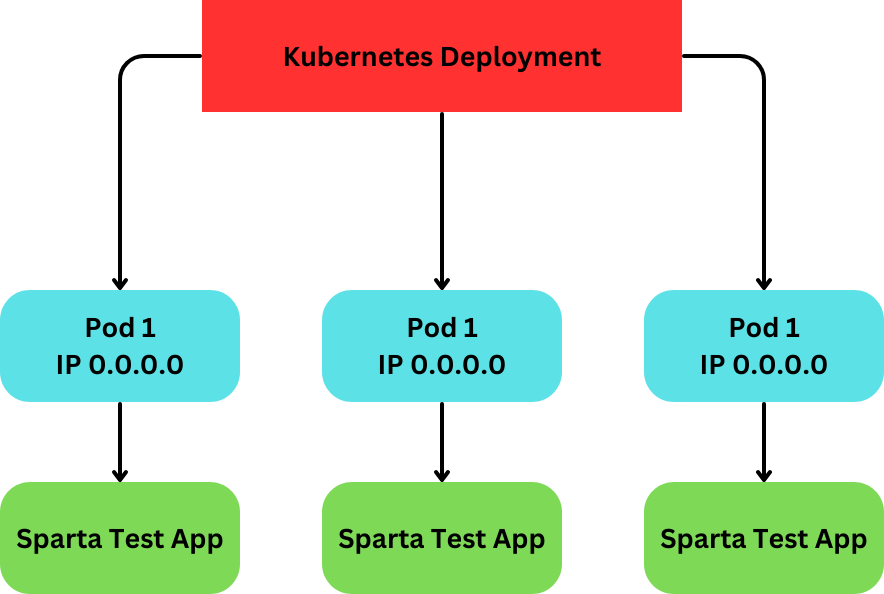

# K8

### What is K8?

- Kubernetes, a powerful tool used to manage and orchestrate containers (like virtualized machines) on a large scale. It simplifies deployment, scaling, and management of software applications. It is also open source.

### Why K8?

- It helps us efficiently manage multiple applications on one server. It does this by dividing them into virtual machines, which keeps them isolated and secure.

- Kubernetes lets you use many Virtual Machines (VMs) on one server's CPU. The VMs keep apps separate, boosting security since one app can't freely access another's info.

### 5 Benefits to KB

- Open-Source
- Automation of deployment and scalability
- More portability with less chance of vendor lock-in
- Cost savings
- Increased DevOps efficiency for microservices architecture

### K8 Architecture Diagram

With Kubernetes you can deploy the app into multiple containers, this is similar to how you can deploy the app on multiple virtual machines however, with this you can have them all running on the same machine and operating system so they can all run on the same CPU. However, because they are all in sepereate containers they can't directly connect with each other providing security.

https://kubernetes.io/docs/concepts/overview/
- This page provides a great overview on the architectural structure of using Kubernetes comparied to other methods as well as explaining what it is and why to use K8.